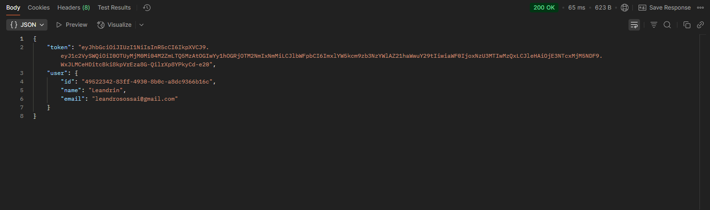
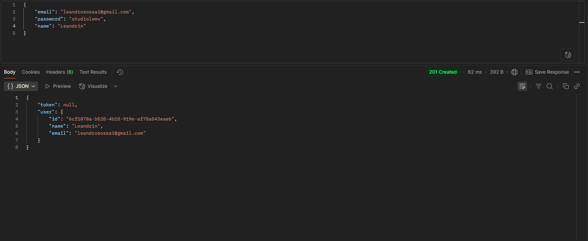
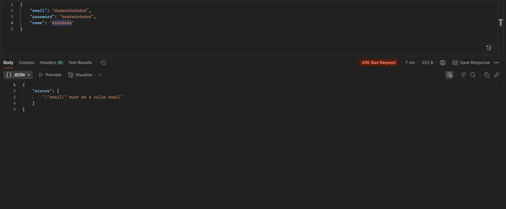

# API Login - Trabalho UNICV

## 📸 Evidências de Testes

### Testes no Postman

#### 🔐 Testes de Autenticação

*Login realizado com sucesso - Status 200*

 
*Login com erro - Status 401*

#### 👥 Testes de Criação de Usuário

*Usuário criado com sucesso - Status 201*

*Erro na criação de usuário - Status 400*

### 🐳 Testes no Docker

*Containers rodando: API, Redis e PostgreSQL*

*Logs da aplicação mostrando autenticação JWT*
