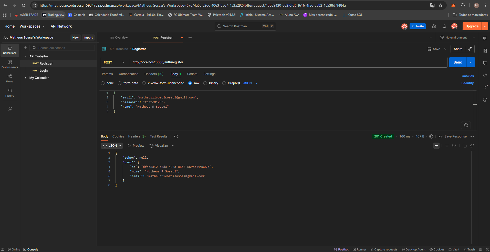
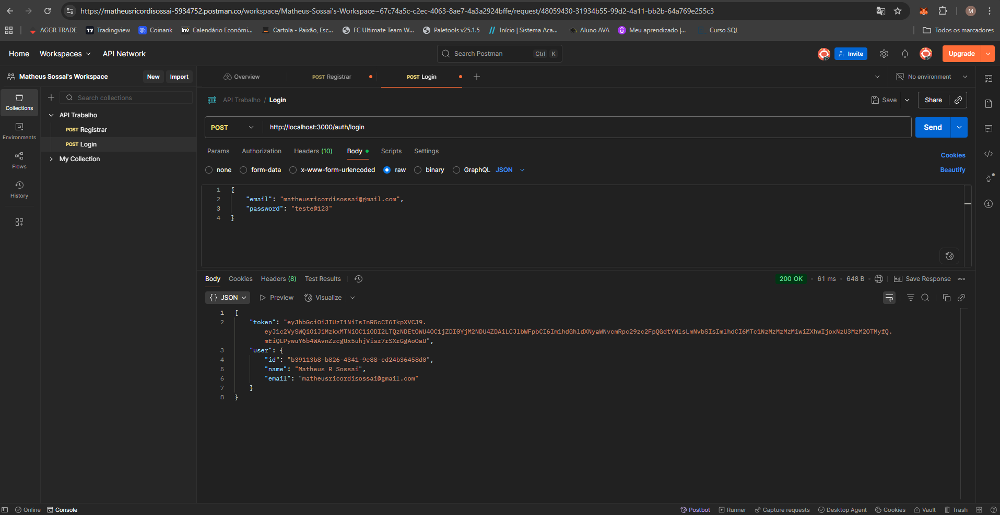
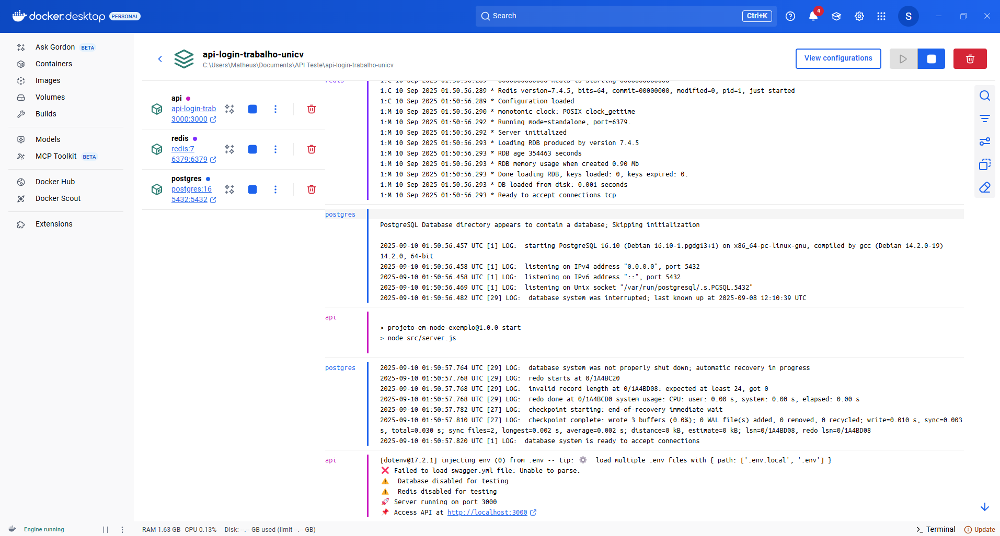

# 🔐 API de Autenticação - Trabalho UNICV

## 📋 Fluxo de Autenticação - Comprovantes

### 1. 👤 Registro de Usuário

*Registro do aluno com nome e email institucional*

### 2. 🔐 Geração do Token JWT  

*Geração do token JWT após login bem-sucedido*

## 🐳 Infraestrutura

*Containers rodando: API Node.js, Redis e PostgreSQL*
